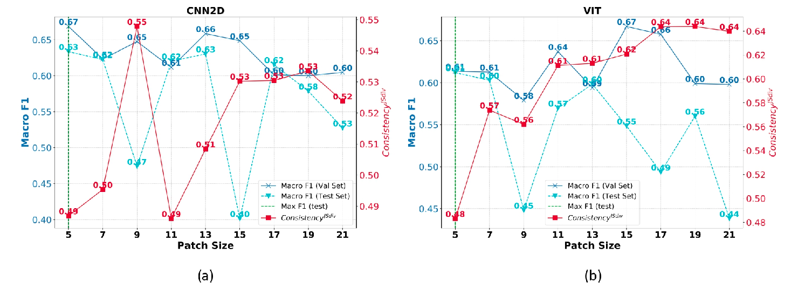

# 🌾 xAIDrivenHyperOpt

<div style="display: inline-block; padding: 10px;">
  
</div>

xAIDrivenHyperOpt is a research-oriented framework designed to optimize Deep Learning models for **spaceborne hyperspectral image classification**, using **explainable AI (xAI)** to guide hyperparameter selection.

This repository supports the paper:

> **Optimizing Deep Learning for Satellite Hyperspectral Data: an xAI-Driven Approach to Hyperparameter Selection**  
> Michele Linardi, Sékou Dabo, Claudia Paris – *IGARSS 2025*

---

## 📌 About the Project

Most deep learning (DL) models for hyperspectral image (HSI) classification are optimized for **airborne sensors**, which typically provide high spatial resolution. However, **spaceborne HSI data** like those from **PRISMA** satellite present different challenges due to their **coarser resolution** and **mixed spectral signatures**.

This project introduces a novel **xAI-driven strategy** for selecting the most appropriate hyperparameters (e.g., patch size) in DL models such as:
- A lightweight 2D-CNN
- A Vision Transformer (ViT)

Instead of relying solely on validation accuracy, we evaluate the **consistency of Integrated Gradients explanations** across model instances using a metric based on **Jensen-Shannon Divergence**.


📖 Learn more in the [official paper](https://github.com/ds4xai/xAIDrivenHyperOpt/tree/main/paper%20(official)).

---


## 📦 Dataset Description

<div style="display: flex; justify-content: center;">
  <div style="padding: 10px; height: 500px; width: 1000px;">
    
  </div>
</div>


The dataset includes a **hyperspectral image** acquired on **May 27, 2020**, over the **Seville region (Spain)**, from the [PRISMA satellite](https://prisma.asi.it/). The original image contains **234 spectral bands** and a spatial resolution of **30 meters**.

We converted the data from **GeoTIFF** to **NumPy `.npy` format** for efficiency.

- Shape: `234 × 1215 × 1091` → Spectral × Height × Width
- After preprocessing: **174 bands** (noisy/water absorption bands removed)

### Ground Truth

The labeled dataset includes **six crop classes**:

| Class ID | Label                  |
|----------|------------------------|
| 1        | Durum wheat            |
| 2        | Oranges                |
| 3        | Permanent grassland    |
| 4        | Rice                   |
| 5        | Sunflower              |
| 6        | Olives                 |

We provide binary masks:
- `train_crops.npy` for training
- `test_crops.npy` for testing

🛰️ PRISMA satellite info: [http://prisma-i.it/](http://prisma-i.it/)

---

## 🔧 Installation

### Prerequisites
- Python ≥ 3.12
- PyTorch ≥ 2.1.0 (with CUDA 11.8 if available)

### Step-by-Step

1. **Clone the repository**
   ```bash
   git clone https://github.com/ds4xai/xAIDrivenHyperOpt.git
   cd xAIDrivenHyperOpt
   ```

2. **Create and activate a virtual environment**

    ```bashpython -m venv env
    source env/bin/activate  # or on Windows: source env/Scripts/activate
    ```

3. **Install dependencies**

    ```bash
    pip install -r requirements.txt
    ```

### 📥 Retrieve Dataset

Make sure you're in the project root. Create the /data folder if it doesn't exist:

```bash
mkdir -p data
```

Download the dataset from this link:
[Download Dataset PRISMA .zip](https://enseafr-my.sharepoint.com/:u:/g/personal/sekou_dabo_ensea_fr/EUzXFpf5irdCvuGVjVy3MLIB6tlp6xAo_d-ascp_pPcYrw?e=RlvxdM)

Unzip the file and move all contents into the data/ directory


### 📊 Data Preparation

This script splits the dataset into train/dev/test, computes mean/std statistics, and saves everything in .mat format:

```bash
python prepocess_dataset.py
```   

### 🧠 Part 1: Modeling and Training

You can modify model hyperparameters in trainer.py.

    💡 Enable Distributed Data Parallel (DDP) by setting `on_ddp=True` in trainer.py.

**Train the model**

```bash
python trainer.py
```

**Evaluate the model**
```bash
python tester.py
```

### 🔍 Part 2: Explainability (xAI)

This step computes attributions using Integrated Gradients (IG) and evaluates them using the Jensen-Shannon Divergence (JSdiv).

1. **Create xAI ground truth mask**

```bash
python build_xai_gt.py
```

2. **Compute Integrated Gradients**

```bash
python attributions.py
```

3. **Evaluate explanations using JSdiv**

```bash
python xai_eval_metrics.py
```  

4. **Visualize attribution metrics**

```bash
python plot_metrics.py
```


### 📈 Results

This section presents the experimental results, including macro F-score and xAI-based consistency metrics across patch sizes.




### 📄 Citation

If you use this project or dataset, please cite our paper:

    @article{xaidrivenhyperopt2025,
    title={Optimizing Deep Learning for Satellite Hyperspectral Data: an xAI-Driven Approach to Hyperparameter Selection},
    author={Michele Linardi and S{\'e}kou Dabo and Claudia Paris},
    journal={IGARSS 2025},
    year={2025}
    }

🧑‍💻 Contact

    Michele Linardi – michele.linardi@cyu.fr

    Sékou Dabo – dabo.sekou@ensea.fr

    Claudia Paris – c.paris@utwente.nl


